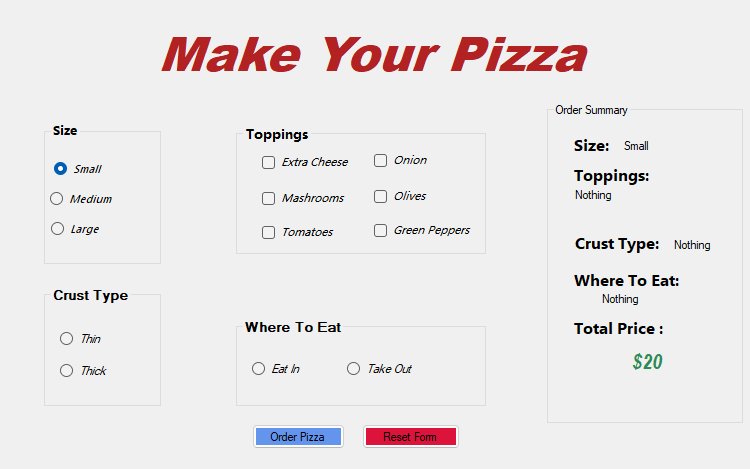

# 🍕 Pizza Order System

A simple Pizza Order System built using **C#** and **Windows Forms**.

This project allows the user to customize a pizza by selecting the size, crust type, toppings, and where to eat. The application calculates the total price automatically and displays the order summary.

## 📸 Project Preview

## ✨ Features

- Select pizza size:
  - Small
  - Medium
  - Large

- Select crust type:
  - Thin
  - Thick

- Select multiple toppings:
  - Extra Cheese
  - Onion
  - Mushrooms
  - Olives
  - Tomatoes
  - Green Peppers

- Choose where to eat:
  - Eat In
  - Take Out

- Automatically calculate the total price.

- Display the order summary.

- Reset the order using the Reset Form button.

## 🛠️ Technologies

- C#
- .NET Framework
- Windows Forms
- Visual Studio

## 🧠 Concepts Practiced

- Windows Forms
- Controls
- Events
- CheckBox
- RadioButton
- GroupBox
- Methods
- `if` statements
- String manipulation
- Type conversion
- Using the `Tag` property
- Calculating prices dynamically
- Updating UI at runtime

## 🚀 How to Run

1. Clone the repository.

2. Open the project using **Visual Studio**.

3. Build the project.

4. Run the application.

## 👨‍💻 Author

**Hamdi Ismail**

Learning **C# / .NET** and working toward becoming a Full-Stack Developer.
